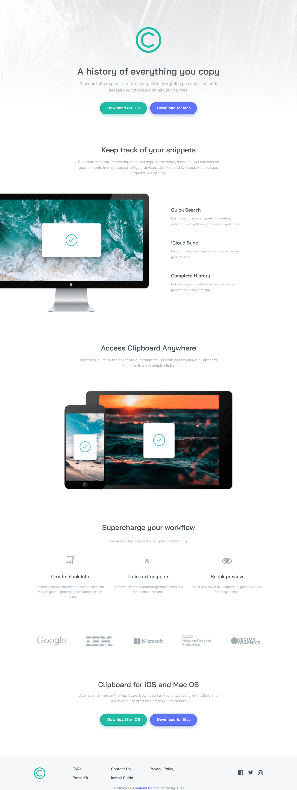

# Welcome! 👋

## Live

[Live](https://felixcriollo.github.io/2.12-Clipboard-landing-page/)

## The Challenge

Your challenge is to build out this landing page and get it looking as close to the design as possible.

You can use any tools you like to help you complete the challenge. So if you've got something you'd like to practice, feel free to give it a go.

Your users should be able to: 

- View the optimal layout for the site depending on their device's screen size
- See hover states for all interactive elements on the page

## Built With

- Semantic HTML5 markup
- CSS custom properties
- Flexbox & Grid
- Mobile first

## What I Practice

With this challenge practice my thinking in the moment to build layout. I'm well with the result.
But i thinking what the naming of my classes in my html elements should improve, i don't know how
and so how can i improve the structure of my html?

Any advice for improve is wellcome  🚀 🚀 🚀

# Frontend Mentor - Clipboard landing page